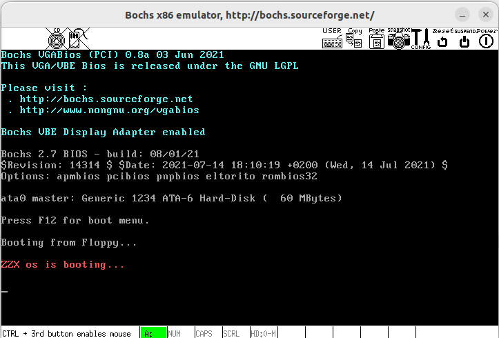
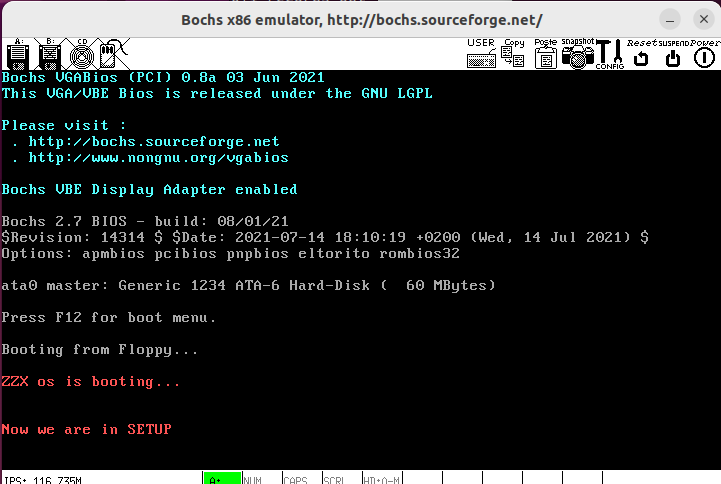
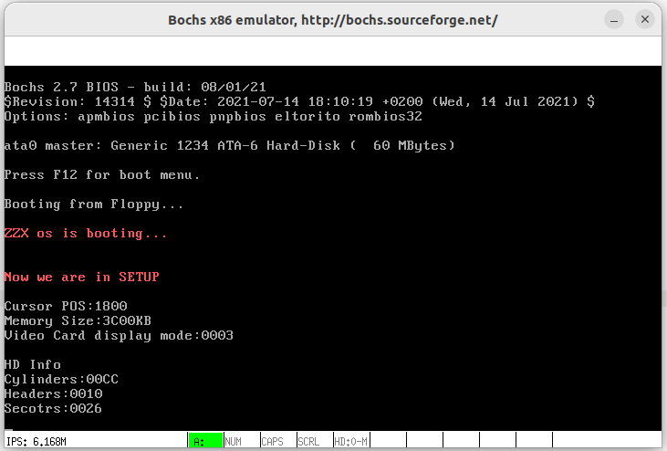

# HITOS-LAB3 Linux0.11操作系统的引导
## 一、实验目的
- 熟悉实验环境；
- 建立对操作系统引导过程的深入认识；
- 掌握操作系统的基本开发过程；
- 能对操作系统代码进行简单的控制，揭开操作系统的神秘面纱。

## 二、实验内容
- 阅读《Linux内核完全注释》的第 6 章，对计算机和 Linux 0.11 的引导过程进行初步的了解；
- 改写 bootsect.s，能在屏幕上打印一段提示信息 `'XXX is booting...'`;
- 改写 setup.s 主要完成如下功能:
  1. 能完成 setup.s 的载入，并跳转到 setup.s 开始地址执行。而 setup.s 向屏幕输出一行 `'Now we are in SETUP'`;
  2. 能获取至少一个基本的硬件参数（如内存参数、显卡参数、硬盘参数等）， 将其存放在内存的特定地址，并输出到屏幕上。
  3. 不再加载Linux内核，保持上述信息显示在屏幕上即可。

## 三、实验报告
### 3.1 回答问题：
> 有时，继承传统意味着别手蹩脚。 x86 计算机为了向下兼容，导致启动过程比较复杂。 请找出 x86 计算机启动过程中，被硬件强制，软件必须遵守的两个“多此一举”的步骤，说说它们为什么多此一举，并设计更简洁的替代方案。

**当 PC 的电源打开后，80x86 结构的 CPU 将自动进入实模式，并从地址 0xFFFF0 开始自动执行 ROM-BIOS 程序代码，以执行系统的某些硬件检测和诊断功能**，由此会带来一些冗余的操作：

1. **引导程序的重复移动**：
   - **多此一举：** 机器加电时，执行 BIOS 中的代码时，由于 BIOS 可访问的内存有限， ROM BIOS 会把引导扇区代码 bootsect 加载到内存地址 0x7c00 开始处并执行之。而在 bootsect 代码执行期间，它会将自己移动到内存绝对地址 0x90000 （内核代码不会超过 512 KB）开始处并继续执行。
    - **更简洁的替代方案：** 在保证可靠性的前提下尽量扩大 BIOS 的可访问的内存的范围，直接将引导扇区代码 bootsect 放置至相对靠后的位置，避免不必要的重复移动。
2. **内核代码的重复移动**：
   - **多此一举：** ROM-BIOS 程序会**在物理地址 0 处开始设置和初始化中断向量（1 KB）**，而在引导扇区代码 bootsect 执行过程中，会：
     - 先将内核代码写入到内存靠后不与 BIOS 中断向量表冲突的位置 0x10000，而以避免覆盖掉之前的中断向量表，因为随后执行的 setup 开始部分的代码**还需要利用 ROM BIOS 提供的中断调用功能**来获取有关机器配置的一些参数。
     - 而后，**在使用完 BIOS 的中断调用后**，为了方便后续程序的加载与运行，将操作系统内核移动到内存的起始处，覆盖掉之前的 BIOS 中断向量表。
   - **更简洁的替代方案：** 在 ROM BIOS 执行时，将 BIOS 的中断向量表存放在内存中可访问且不与引导扇区代码冲突的位置，直接将内核代码加载到 0x0000 处，避免内核代码的来回移动。
3. **实模式**：
   - **多此一举：** x86架构中的实模式是一种启动过程的一部分，它是一种16位的模式，用于向后兼容早期的x86处理器。在实模式下，操作系统需要与旧的16位编程模型兼容，这导致启动过程中需要经历从实模式到保护模式的切换，这是一种冗长和不必要的过程。
   - **更简洁的替代方案：** 更简洁的替代方案是直接从启动时进入保护模式。在保护模式下，操作系统能够更好地管理内存和硬件资源，而无需与16位实模式的限制和复杂性打交道。这将提高启动速度和操作系统的性能，但需要重新设计引导加载程序和操作系统内核，以直接在保护模式下工作。


## 四、实验过程及截图
由于实验环境选用的是新版本实验环境 https://gitee.com/guojunos/oslab2020.git ，oslab/linux-0.11 目录下 makefile 没有与 `make BootImage` 相匹配的指令，因而本实验全部采用 AT&T 语法，通过仿写或直接在 oslab/linux-0.11 目录下进行 `make all` 操作进行编译实现实验内容
### 4.1 bootsect 显示
仿照 Linux0.11 源码进行编写，使 bootsect.s 能在屏幕上打印一段提示信息 `'XXX is booting...'`。

其原理就是利用 BIOS INT 0x10 功能 0x03 和 0x13 来显示信息：“ 'XXX is booting...'+回车+换行”，显示包括回车和换行控制字符在内共 26 个字符，核心代码为：
```assembly
	mov	$BOOTSEG, %ax
	mov	%ax, %ds	
	mov	%ax, %es
	mov	$0x03, %ah		# read cursor pos
	xor	%bh, %bh
	int	$0x10
	mov	$26, %cx
	mov	$0x000c, %bx		# page 0, attribute 7 (normal)
	mov	$msg1, %bp
	mov	$0x1301, %ax		# write string, move cursor
	int	$0x10
```
其中，BIOS 中断 0x10 功能号 ah = 0x03，读光标位置；BIOS 中断 0x10 功能号 ah = 0x13，显示字符串。而 es:bp 寄存器则指向要显示的字符串起始位置处

实际操作主要分为以下几个步骤：
1. 将原来`.msg1`中的字符串 `'Loading System'` 修改为自己的信息`'ZZX os is booting...'`
    ```assembly
    msg1:
      .byte 13,10
      .ascii "ZZX os is booting..."
      .byte 13,10,13,10
    ```
2. 更改要显示的字符串长度为26，同时改变字体颜色为红色(bx的值对应 0x0007 为黑色，0x000c 为红色)
    ```assembly
      mov	$26, %cx
      mov	$0x000c, %bx		# page 0, attribute 7 (normal)
    ```

3. 加入死循环 `inf_loop` **防止越界**
    ```assembly
    inf_loop:
      jmp 	inf_loop
    ```
4. 编译 bootsect.s
   1. 如果使用的是**as86汇编**语言，执行下面语句编译和链接 `bootsect.s`，同时去掉 32 个字节的`Minix` 可执行文件头部
    ```Shell
    as86 -0 -a -o bootsect.o bootsect.s
    ld86 -0 -s -o bootsect bootsect.o
    dd bs=1 if=bootsect of=Image skip=32
    ```
   2. 如果使用的是**x86汇编**语言，则执行新的 oslab/linux-0.11/boot 目录下的makefile 文件可以直接汇编和链接代码文件
    ```makefile
    include ../Makefile.header

    LDFLAGS	+= -Ttext 0

    all: bootsect setup

    bootsect: bootsect.s
      @$(AS) -o bootsect.o bootsect.s
      @$(LD) $(LDFLAGS) -o bootsect bootsect.o
      @$(OBJCOPY) -R .pdr -R .comment -R.note -S -O binary bootsect


    setup: setup.s
      @$(AS) -o setup.o setup.s
      @$(LD) $(LDFLAGS) -o setup setup.o
      @$(OBJCOPY) -R .pdr -R .comment -R.note -S -O binary setup

    head.o: head.s
      @$(AS) -o head.o head.s

    clean:
      @rm -f bootsect bootsect.o setup setup.o head.o
    ```
    
    即在 oslab/linux-0.11/boot 执行语句即可得到执行文件
    ```shell
    make bootsect
    ```
5. 将得到的执行文件 bootsect 改名为Image，放到 oslab/linux-0.11 目录下，执行语句`./dbg-bochs`即可得到如下界面。可以看到，`'ZZX os is booting...'` 语句成功显示。

#pic_center

### 4.2 bootsect 读入 setup
实现 setup.s 的载入，并跳转到 setup.s 开始地址执行主要包括以下几步：

1. 首先编写一个 setup.s ，该 setup.s 可以就直接拷贝前面的 bootsect.s，然后将其中的显示的信息改为 `'Now we are in SETUP'`：
    ```assembly
    msg2:
      .byte 13,10
      .ascii "Now we are in SETUP"
      .byte 13,10,13,10
    ```

2. 在 bootsect.s 中**删除之前的死循环**，编写载入 setup.s 的关键代码，即在加载setup到内存之后，跳转至setup的起始地址处。
   - 实质上就是利用 ROM BIOS 中断 INT 0x13 将 setup 模块从磁盘第 2 个扇区开始读到 0x90200 开始处，共读 4 个扇区。在读操作过程中如果读出错，则显示磁盘上出错扇区位置，然后复位驱动器并重试，没有退路。
   - INT 0x13 读扇区使用调用参数设置如下：
     ah = 0x02 读磁盘扇区到内存； al = 需要读出的扇区数量；
     ch = 磁道(柱面)号的低 8 位； cl = 开始扇区(位 0-5)，磁道号高 2 位(位 6-7)；
     dh = 磁头号； dl = 驱动器号（如果是硬盘则位 7 要置位）；
     es:bx 指向数据缓冲区； 如果出错则 CF 标志置位， ah 中是出错码。
    ```assembly
      load_setup:
        mov	  $0x0000, %dx		# drive 0, head 0
        mov	  $0x0002, %cx		# sector 2, track 0
        mov	  $0x0200, %bx		# address = 512, in INITSEG
        .equ  AX, 0x0200+SETUPLEN
        mov   $AX, %ax		# service 2, nr of sectors
        int	  $0x13			# read it
        jnc	  ok_load_setup		# ok - continue
        mov	  $0x0000, %dx
        mov	  $0x0000, %ax		# reset the diskette
        int	  $0x13
        jmp	  load_setup
      
      ok_load_setup:
        ljmp  $SETUPSEG, $0
    ```
3. 链接
    > **直接在 /oslab/linux-0.11 目录下执行 `make all` 也可以正常编译。**

    在 oslab/linux-0.11 目录下的 Makefile 文件内增加下列语句
    ```makefile
      BootImage: boot/bootsect boot/setup
        @tools/build.sh boot/bootsect boot/setup none Image $(ROOT_DEV)
        @sync
    ```
    而后在 oslab/linux-0.11 目录下执行
    ```shell
    make BootImage
    ```
    会出现报错
    ```shell
    there is no system binary file there
    make: *** [Makefile:44: BootImage] Error 255
    ```
    这是因为 make 根据 Makefile 的指引执行了 tools/build.c，它是为生成整个内核的镜像文件而设计的，没考虑我们只需要 bootsect.s 和 setup.s 的情况。因此需要修改 /oslab/linux-0.11/tools/build.sh，注释掉以下语句即可成功编译
    ```sh
    # [ ! -f "$system" ] && echo "there is no system binary file there" && exit -1
    # system_size=`wc -c $system |cut -d" " -f1`
    ```
4. 执行，在 oslab/linux-0.11 目录下，执行语句`./dbg-bochs`即可得到如下界面。



### 4.3 setup 获取硬件参数
**setup.s 将获得硬件参数放在内存的 0x90000 处。**
- 用 ah=0x03 调用 0x10 中断可以读出光标的位置，并保存在内存 0x90000 处（2 字节）
```assembly
# ok, the read went well so we get current cursor position and save it for posterity.
	mov	$INITSEG, %ax	# this is done in bootsect already, but...
	mov	%ax, %ds
	mov	$0x03, %ah	# read cursor pos
	xor	%bh, %bh
	int	$0x10		# save it in known place, con_init fetches
	mov	%dx, %ds:0	# it from 0x90000.
```
- 用 ah=0x88 调用 0x15 中断可以读出内存的大小，并保存在内存 0x90002 处（2 字节）
```assembly
# Get memory size (extended mem, kB)
	mov	$0x88, %ah 
	int	$0x15
	mov	%ax, %ds:2
```
- 用 ah=0x12, bl=0x10 调用 0x10 中断可以检查显示方式（ EGA/VGA ）并取参数。0x9000A 为安装的显示内存； 0x9000B 为显示状态(彩/单色)，0x9000C 为显示卡特性参数。
```
# Get video-card data
	mov	$0x12, %ah
  mov	$0x10, %bl 
	int	$0x10
  mov %ax, %ds:8
	mov	%bx, %ds:10
 	mov	%cx, %ds:12 
```
- 中断向量表中 int 0x41 的中断向量位置( 4*0x41 = 0x0000:0x0104 )存放的并不是中断程序的地址，而是第一个硬盘的基本参数表。读取这两个磁盘的相关参数，复制到 0x90080 地址处
```
# Get hd0 data
	mov	$0x0000, %ax
	mov	%ax, %ds
	lds	%ds:4*0x41, %si
	mov	$INITSEG, %ax
	mov	%ax, %es
	mov	$0x0080, %di
	mov	$0x10, %cx
	rep
	movsb
```
- 第二个硬盘的基本参数表入口地址存于 int 0x46 中断向量位置处，读出到 0x90090 地址处（方法与上述第一个磁盘相同）

### 4.4 setup 显示硬件参数
**用汇编程序在屏幕上将这些无符号整数的参数显示出来。** 只需将原二进制数每 4 位划成一组，按组求对应的 ASCII 码送显示器即可。

ASCII 码与十六进制数字的对应关系为： 0x30~0x39 对应数字 0~9 ， 0x41~0x46 对应数字 a~f 。

在此使用 ah=0x0e 调用 0x10 中断可以显示单个字符，AL 为要显示字符的ASCII码

```assembly
print_hex:
    	mov    $4, %cx         # 4个十六进制数字
    	mov    %ax, %dx        # 将(bp)所指的值放入dx中，如果bp是指向栈顶的话
    
print_digit:
    	rol    $4, %dx         # 循环以使低4比特用上 !! 取dx的高4比特移到低4比特处。
    	mov    $0xe0f, %ax     # ah = 请求的功能值，al = 半字节(4个比特)掩码。
    	and    %dl, %al        # 取dl的低4比特值。
    	add    $0x30, %al      # 给al数字加上十六进制0x30
    	cmp    $0x3a, %al
    	jl     outp            # 是一个不大于十的数字
    	add    $0x07, %al      # 是a～f，要多加7
    
outp:
	int    $0x10
	loop   print_digit
	ret
```
而打印回车与换行符同理
```assembly
print_nl:
	mov    $0xe0d, %ax   # CR
	int    $0x10
	mov    $0xa, %al     # LF
	int    $0x10
	ret
```
而打印前缀字符串的过程与上述 bootsect 显示类似，打印参数时，通过 `%ds:偏移` 将参数传递给 `%ax`
```assembly
	mov 	%ds:0, %ax
	call	print_hex
	call	print_nl
```
经过一系列的调试即可得到下图结果，其中
- 内存大小为 0x3C00KB=15MB
- 显卡参数为 0x0003 对应显示内存为 256KB ，显示模式为彩色模式
- 磁盘 0 柱面数为 0x00CC 对应 204，磁头数为 0x0010 对应 16, 扇区数为 0x0026 对应 38

与 bochs/linux-0.11.bxrc 文件中参数吻合，说明引导成功。
```
……
megs: 16
vgaromimage: file=$BXSHARE/VGABIOS-lgpl-latest

floppya: 1_44="$OSLAB_PATH/linux-0.11/Image", status=inserted
ata0-master: type=disk, path="$OSLAB_PATH/hdc-0.11.img", mode=flat, cylinders=204, heads=16, spt=38
boot: a
……
```

